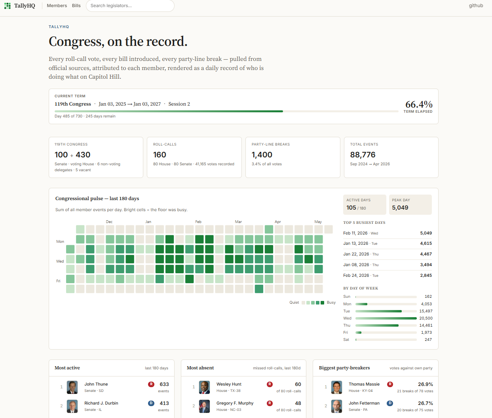

# TallyHQ

**Live at [tallyhq.org](https://tallyhq.org)**

> Congress, on the record. A GitHub-style activity tracker for the US Congress.

Every roll-call vote, every bill introduced, every party-line break, every floor speech — pulled from official sources, attributed to each member, rendered as a daily record of who is doing what on Capitol Hill.



## What it shows

- **Per-legislator activity grid** (GitHub-contribution-style 7×N heatmap) over the past year
- **Roll-call detail pages** with party-by-party tallies and break-vote highlighting
- **Bill detail pages** with sponsor, cosponsors, action timeline (stage-coded), text-version downloads
- **Bills index** searchable by title, filterable by chamber + type + policy area
- **Browse** members with committee/subcommittee filtering and live aggregate stats for the selection
- **Landing dashboard** — congressional pulse heatmap, top-active / most-absent / biggest-party-breakers rankings, recent break-votes timeline

## Architecture

Single Python service (FastAPI + Jinja templates) with a single embedded DuckDB file for storage. Append-only event store with `(source, source_id, payload_hash)` dedupe. Adapters fan structured data out to per-legislator events that all surfaces (grid, profile, browse aggregates) compute over.

### Data sources

| Source | What | Free | Key required |
|---|---|---|---|
| `clerk.house.gov` XML | House roll-call votes | ✓ | no |
| `senate.gov` XML | Senate roll-call votes | ✓ | no |
| `govinfo.gov BILLSTATUS` | Bill metadata + sponsor + cosponsors + actions | ✓ | no |
| `govinfo.gov CREC` | Floor speeches (Congressional Record metadata) | ✓ | no |
| `api.congress.gov` | Amendments + bill enrichment | ✓ | yes |
| `lda.senate.gov` | Lobbying disclosures | ✓ | optional (raises rate limit) |
| `api.open.fec.gov` | Campaign finance totals | ✓ | yes |
| `unitedstates/congress-legislators` (YAML) | Member roster + committee assignments + ID crosswalks | ✓ | no |
| `unitedstates/images` (gh-pages) | Member portraits | ✓ | no |

## Quick start (local)

```bash
pip install -e .

# 1. Seed entity tables
conductor politics sync-legislators
conductor politics sync-committees

# 2. Pull events
conductor politics bulk-bills --congress 119 --bill-types all   # ~30 min
conductor pull congress_rollcalls
conductor pull senate_rollcalls
conductor pull congress_amendments
conductor pull govinfo_crec        # floor speeches
conductor politics sync-funding --cycles 2026,2024

# 3. Run web
conductor politics web   # http://127.0.0.1:8770
```

## Environment

Copy `.env.example` to `.env` and fill in:

- `CONGRESS_GOV_API_KEY` — required for amendments + member-photo fallback (free at https://api.congress.gov/sign-up/)
- `OPENFEC_API_KEY` — required for campaign-finance totals (free at https://api.open.fec.gov/developers)
- `LDA_API_KEY` — optional, raises lobbying-disclosure rate limit (free at https://lda.senate.gov/api/register/)

## Deployment

See `DEPLOY.md` for Railway setup (web service + cron service sharing one persistent volume).

## License

MIT
